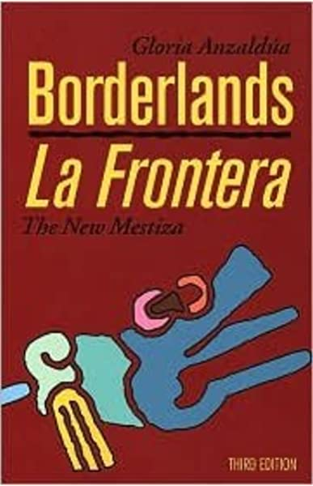
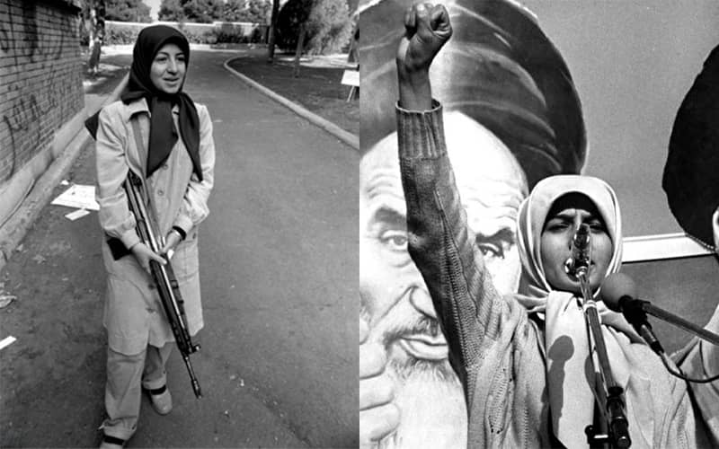
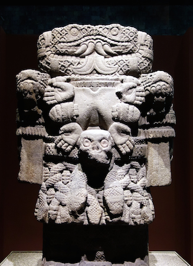

Feminism is a convoluted, and often cyclical journey. It requires a lifetime of learning new ways of interpreting the world, and unlearning interpretations. One method of developing one’s feminist consciousness is global feminism. Gloria Anzaldua contributes her book *Borderlands: La Frontera* as a memoir and a piece of literature to aid in a global feminist awareness. In *Borderlands*, Anzaldua addresses how one can acknowledge repressive systems, while also rising above them. Anzaldua employs parallelism, variation in genre, and motifs of dichotomy and the Coatlicue State to illustrate how identity formation is an integral part of developing a global feminist consciousness. Her work exhibits that a feminist’s identity must transcends her nation and the oppressive systems she exists in.

*Book cover of Gloria Anzaldua's Borderlands: La Frontera*

By consuming and sharing global women’s experiences, we are able to better understand patriarchal values and how they are derived. By exploring the global contexts of sexism, racism, and other forms of oppression, we can find patterns in how patriarchal values are expressed. This allows us to devise more precise solutions for rebellion. For example, if we focus only on the scope of only modern American culture, we might notice the pressures put on women to wear makeup. The root cause might seem straightforward: men have a sexual preference for women who wear makeup and their power under patriarchy allows them to enforce this via forms of social exclusion/ridicule.

Alternatively, if we take the time to learn about global cultures, we will see this norm exists in other cultures. We could also identify similar cultural expectations surrounding women’s appearances, such as clothing, hair styles, body shape, etc. We would even see that some cultures *restrict* women from wearing makeup. This knowledge informs us that there may actually be a more universal patriarchal behavior: restrictions on women’s expression and bodily autonomy. This broadened perspective we gain from observing oppression globally provides a more directed path in deconstructing oppression. To paraphrase Serena Parekh, et. al. in "Feminist Perspectives on Globalization", understanding systematic oppression in a global context can also inform us on how one's culture impacts the way in which these more universal beliefs are expressed. These are data points that are just as integral to liberation as studying intersectional feminism or the history of feminist movements (Parekh).

> "I had thought that to be philosophical or to ask questions about the nature of reality was not to do feminism: that feminism was about something particular and not general, relative not universal, that feminism was about questioning and challenging sexual violence, inequality, and injustice and not the nature of reality as such. I did not understand that feminism was a way of questioning the universal. I did not appreciate how questioning sexism is one of the most profound ways of disrupting what we take to be given and thus learning about how the given is given. Feminist theory taught me that the universal is what needs to be exploded. Feminist theory taught me that reality is usually just someone else's tired explanation."

*Excerpt from "Feminism is Sensational" by Sara Ahmed*

Developing a feminist consciousness and raising awareness is not the ultimate goal of global feminism. One of the many goals is to recognize disproportionality in how oppression is exerted throughout the world (Herr 145-146).  Ultimately, this allows us to allocate appropriate resources (financial, intellectual, etc.) to challenging these systems and participate in mutual aid. This requires an understanding of the history of imperialism, colonialism, and Western feminist influence (Dixon). The Vice President of Iran for Women and Family Affairs, Masoumeh Ebtekar, emphasizes the necessity of evaluating both historical context and global contexts in rebellion. V.P. Ebtekar was the spokeswoman for students in the Iran hostage crisis of 1979. She states in an interview with Vice, regarding activism during the Iranian Revolution and in modern day Iran:

> "We have to see everything in the historical context that it took place. Those early days of the revolution, the youth at that time, they were listening to what was happening in the world in terms of all the anti-imperialist movements. And even the young generation today, they understand very well how these terrible sanctions today, inflicted by the American government..."

*Ebtekar in an interview about activism in Iran (Vice 34:35-35:50)*

The "early days of the revolution" refers to the beginning of the Iranian revolution, in which a political transition transpired - from a pro-Western authoritarian monarchy (the Shah) to an anti-Western theocracy (an Islamic republic under the Grand Ayatollah Ruhollah Khomeini). The perception of the Shah at the time was that he was a puppet of Western influence, so it was important for protesters in support of the Revolution, like Ebtekar, to deeply understand the influence of Western captialism, globalization, and imperialism. Americans expressed that Ebtekar's "familiarity with America added profound emphasis to her rejection of it".

As Iran continues to be held under sanctions by the U.S. government, Ebtekar is insisting the benefit and necessity in studying how Western imperialism plays a role in the oppression of the Iranian people- oppression that disproprtionately affects women due to the ties between patriarchy and imperialism, as well as patriarchal values from Iran and Western countries. Developing feminist perspectives and strategies based in global feminism will better account for the impacts colonization and imperialism have had on non-Western women. Consequently, it will allow for more freedom from patriarchal values.

*Massoumeh Ebtekar, deputy president and spokesperson of U.S. embassy’s hostage-takers in 1979* ([https://www.iranfocus.com/en/terrorism/45251-irans-hostage-taking-government-only-responds-to-firmness/](https://www.iranfocus.com/en/terrorism/45251-irans-hostage-taking-government-only-responds-to-firmness/))

Gloria Anzaldua’s piece, *Borderlands*, exhibits the importance of global awareness and recognizing the effects of colonization with her use of historical accounts along with other genres such as memoir, poetry, and critical theory. Anzaldua demonstrates how epistemic oppression of nations that were “conquered” contributes to the present-day (and future) consequences Mexicans/mestiza face. In “The Homeland, Aztlan”, Chapter 1 of Anzaldua’s book, she discusses how Spanish and American colonists committed brutal and immoral acts on Mexicans, mestizos, Tejanos, and other indigenous people, in order to conquer their land (Borderlands 3-13). During a battle that followed, the Battle of Alamo, Mexican troops reclaimed the Alamo Mission, killing many Texians and Tejanos who were inside. She goes on to explain how this event was used by Anglos and Spanish to “legitimize the white imperialist takeover” by symbolizing “the cowardly and villainous character of the Mexicans” (Anzaldua 6). Her ability to synchronize depictions of present-day oppression in Mexico (and the emotion that accompanies it) with these historical recollections allows the audience to see the importance in recognizing how imperialism and colonialism contribute to systems of oppression (Haefele-Thomas 3; ch. 7).

Anzaldua also explains how imperialist influence contributes to sexism in both America and Mexico. She utilizes the parallelism in the two sides of the border (i.e. the “borderlands”) to demonstrate how patriarchy exists and is expressed in different cultures. In the borderlands, Mexican women (as opposed to men) are especially at risk of being abused and exploited. When trying to cross the border to America, a Mexican woman is at risk of physical and sexual violence because she is in a vulnerable state of pursuing refuge (Borderlands 12). However, if she makes it to America, she is again at risk of being taken advantage of by American employers because of her vulnerable state. This scenario implies that even if a woman can physically escape her own culture’s patriarchy, she is still vulnerable to global patriarchy. To reiterate more emblematically, even if a woman can devise a way to escape or “master” her own culture’s patriarchal behaviors in some way, she will still not have achieved true feminist consciousness. This highlights how nationalist feminism, especially nationalist feminism performed in privileged countries like America, is regressive. It does not provide safety nor liberation for all women. 

The parallel drawn between American and Mexican exploitation of mestiza women is a very literal representation that informs us on the detriments of imperialism. Anzaldua also utilizes more symbolic motifs of dichotomy and the Coatlicue State throughout her book to show the audience how a feminist rebellion is aided by informed and careful identity formation. This identity must transcend social/political/cultural categorizations. By illustrating how these cultural values engrained in a mestiza woman are incompatible, Anzaldua exhibits the oppressiveness of dichotomies. Throughout her writing she consistently identifies dichotomies in the cultures she’s a part of, such as the dichotomy of the borderlands, Anglo and indigenous, male and female, and many more (Borderlands 17-19).

*Coatlicue, c. 1500, Mexica (Aztec) (National Museum of Anthropology, Mexico City), photo: Steven Zucker (CC BY-NC-SA 2.0)*

In “Towards a New Consciousness”, Anzaldua explains, “Like others having or living in more than one culture, we get multiple, often opposing messages… commonly held beliefs of the white culture attack commonly held beliefs of the Mexican culture, … Subconsciously, we see an attack on ourselves...” (Borderlands 78). 

However, it is clear from her first statement, that dichotomies do not solely repress multiracial/multiethnic women. She also notes that living in more than one culture is enough to make one conscious of how culture can infiltrate and diminish one’s identity. The reason dichotomies are so harmful to all women is made clear in an earlier quote from the section “Movimientos de 'rebeldia y las culturas que traicionan”, in which she states, “Culture is made by those in power – men.” (Borderlands 16). This idea reinforces the necessity for a feminist to critically evaluate her nation's cultural values as a stage in developing a feminist consciousness. 

It is not just women who are harmed by these standards either (but the impact *is* disproportial). One can consider the implications of these ideas for men of color, gender non-conforming individuals, and so on. A discussion on patriarchy is therefore beneficial to all of these groups. However, this dialogue will not be addressed further in this paper.

Anzaldua illustrates to the audience how to transcend these dichotomies through the allegory of the Coatlicue State. Coatlicue is a goddess of birth and death, who represents a mother of the Earth. Coatlicue is the antithesis to dichotomy; she represents “*duality* in life, a synthesis of duality, and a third perspective” (Borderlands 46). Anzaldua advocates that we all strive to embody the Coatlicue State. This state is very similar to the Anzaldua's notion of the *mestiza consciousness*; both are methods of “fusing opposites”. She demonstrates, via her challenging yet rewarding journey of achieving a "new consciousness", that conflicting values do not have to be hinderances to completeness. Existing in a mestiza consciousness or the Coatlicue state is not to reject the reality that conflicting values persist in different cultures and within ourselves. Feminism is not a monolith. It may be impossible to develop a universal feminist ethic that unites all women on a singular path. However, Anzaldua enlightens us to the idea that contrast and ambiguity do not prohibit the establishment of a global feminist consciousness.

<ins>Sources</ins>

Anzaldúa, Gloria. *Borderlands: La Frontera*. San Francisco: Aunt Lute Books, 1999. Print.

Bowden, Mark, Guests of the Ayatollah , Atlantic Monthly Press, 2006, pp. 162–3.

Dixon, Violet K. "Western Feminism in a Global Perspective." Inquiries Journal/Student Pulse 3.02 (2011). [http://www.inquiriesjournal.com/a?id=395](http://www.inquiriesjournal.com/a?id=395)

Herr, Ranjoo Seodu. “The Possibility of Nationalist Feminism.” Hypatia, vol. 18, no. 3, 2003, pp. 135–160., doi:10.1111/j.1527-2001.2003.tb00825.x.

Parekh, Serena and Shelley Wilcox, "Feminist Perspectives on Globalization", The Stanford Encyclopedia of Philosophy (Spring 2020 Edition), Edward N. Zalta (ed.), URL = [https://plato.stanford.edu/archives/spr2020/entries/feminism-globalization/](https://plato.stanford.edu/archives/spr2020/entries/feminism-globalization/).

Vice. “Vice Guide to Iran with Suroosh Alvi”. Vice Media, Apr. 15, 2020. (34:35-35:50). [https://www.youtube.com/watch?v=voA0cS1JiGQ&t=2105s](https://www.youtube.com/watch?v=voA0cS1JiGQ&t=2105s).