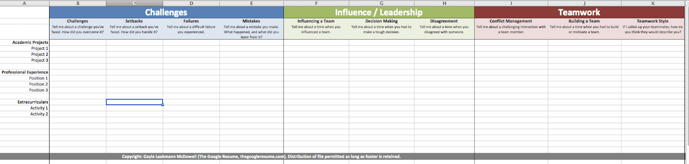

<h2>What is the Behavioral Interview Prep Grid?</h2>

Feel free to scroll to the bottom of the page if you know about this template and just want the link :)

...

Behavioral interviews require us to dig deeper into our past professional and academic experiences, to demonstrate what kind of engineer and team member we are. They also require us to dig ***deep*** into our memory to recall past experiences. It's completely normal to have difficulty recalling our past, especially when we're put on the spot in an interview, all while being expected to show our best selves! 

So, in her interview preparation guide, ***Cracking the Coding Interview***, Gayle Laakmann McDowell shared with us all an amazing template to prepare stories and responses to common behavioral questions ***before*** an interview. 

This template covers a variety of questions such as, professional challenges we overcame, how we resolve conflict in the workplace, and how we respond to failures. While this doesn't cover ALL possible questions you might be asked, many behavioral questions in an interview can be reduced to these basic questions, as they're integral to getting to know a candidate.

<h2>The Template I'm Sharing</h2>

This is the screenshot I based the template off of:

This is the link to the public Google Sheet template:
https://docs.google.com/spreadsheets/d/e/2PACX-1vTse2ZIU8eS18i9LvxCf0LKPnGUc8Tc_JF2PkqzxC4jo_vXHk7JcyRSryrny2fQSl1hLkJ8Kjh5VygE/pubhtml

I came across a screenshot of this grid template in <a href="https://simpleprogrammer.com/ace-behavioral-interview/">this article</a>, and I wanted to share an easily editable template I created for other's who are in the process of preparing for technical interviews. If you experience any problems, feel free to reach out to me via email at naomisp99@gmail.com, otherwise, enjoy prepping!