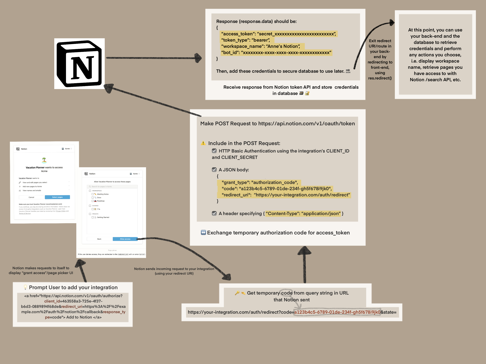

As I develop a public integration with the new Notion API, I wanted to share a flow diagram I created. In my integration, I use a Node/Express.js back-end to gain user's Notion workspace credentials. Once I have the credentials, I can make calls to the Notion API to retrieve user's page/workspace content, update content, etc. In the future, I hope to elaborate on this post and/or create more to provide more resource that are specific to Node and Express.js, like example code.

<h2>Background</h2>

This diagram is meant to demonstrate the flow of authorizing a public integration in user's Notion workspaces. This process begins with a single link to request a user of your integration to grant authorization to their desired workspaces i.e. pages, databases, etc. (see lower left corner of diagram). This link can exist in the front-end code, as it only exposes the client_id and your redirect uri.

<h2>Notion API and OAuth 2.0</h2>

Notion utilizes the <strong>OAuth 2.0</strong> flow for the authorization process. The goal of this process is to use OAuth and the Notion Authorization API to allow a user to grant authorization *to* the public integration to access the user's Notion workspaces. The end goal is to retreive an "access token" that you, the creator of the integration, can add to a secure database and use throughout your integration to make calls to the Notion API. This will allow you to query pages and other content, update content, and other actions.
 

<blockquote>
<h3> ** Disclaimer ** </h3>
This diagram can be used as a helpful frame of reference, but please do your own research on the OAuth 2.0 flow as well, to ensure you fully understand the process and complete each step in a safe and secure manner. Additionally, please reach out to me via LinkedIn or email for support or help! :)
</blockquote>

Click image to open enlarged image in new tab

  